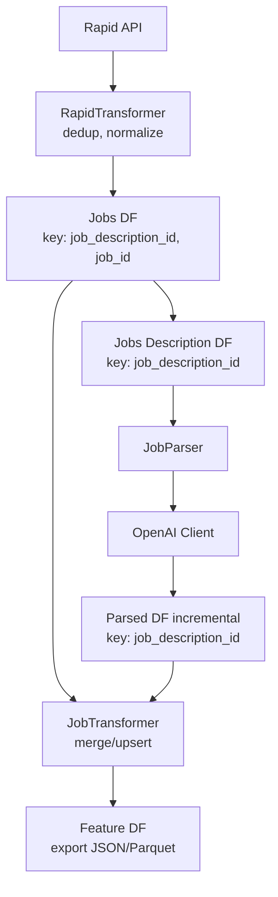

# annalyticai

Turn messy job postings into clean, structured, analytics-ready data. 
The system fetches jobs from RapidAPI, deduplicates and normalizes them, then uses an LLM (guided by your curated QUAL rules and title heuristics) to parse each description into a canonical title, skills/stack, and a short summary. 
Parsed results are merged incrementally into a unified feature dataset for search, matching, and market analytics.

